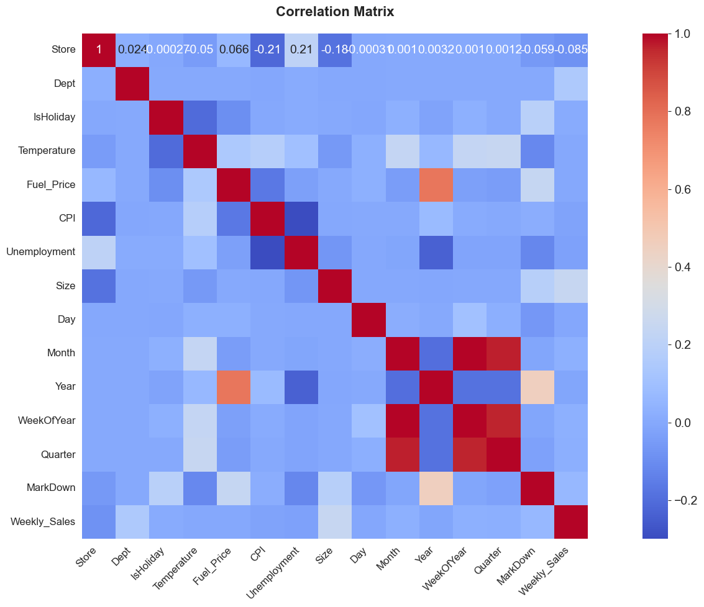
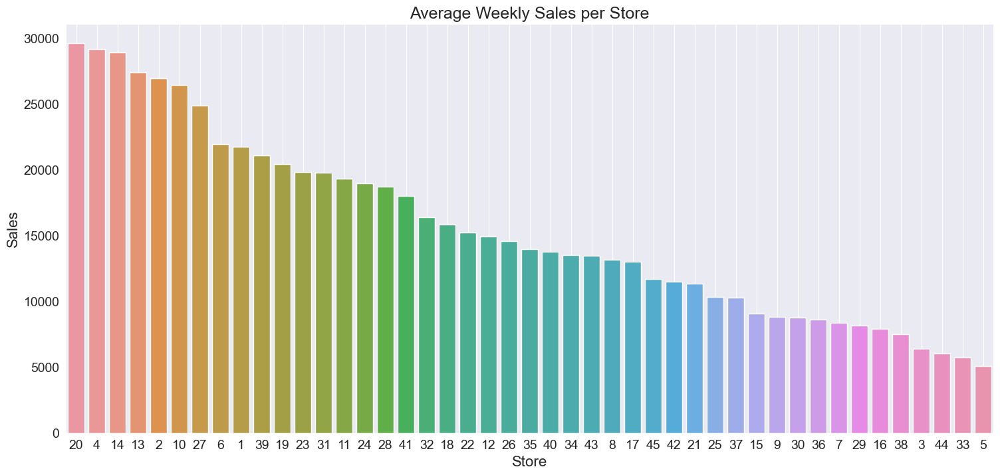
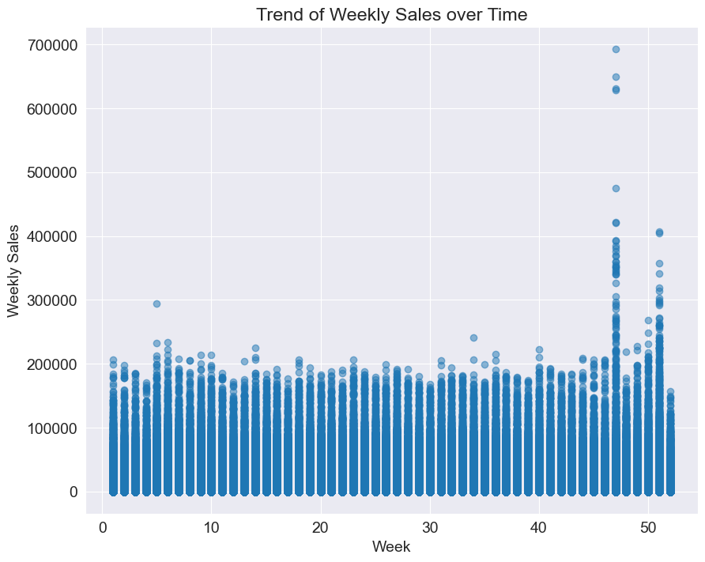
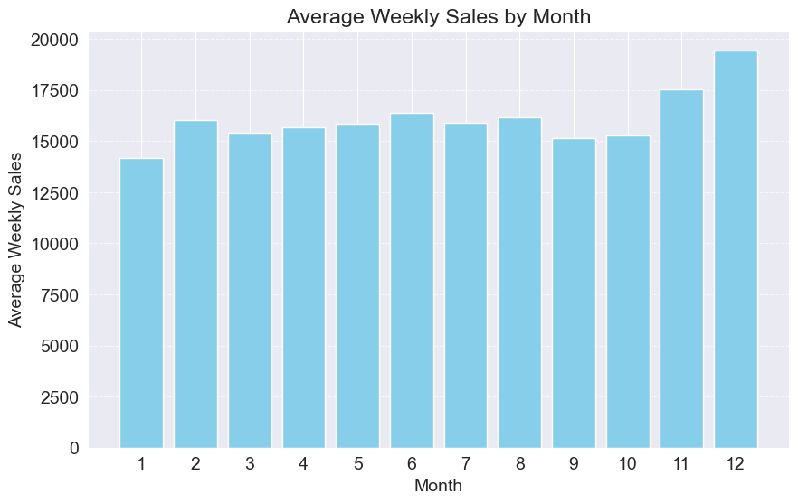
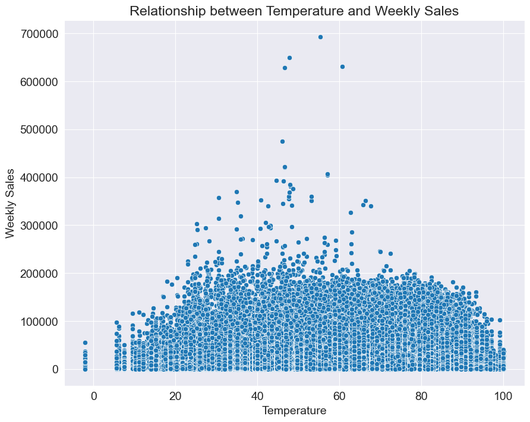
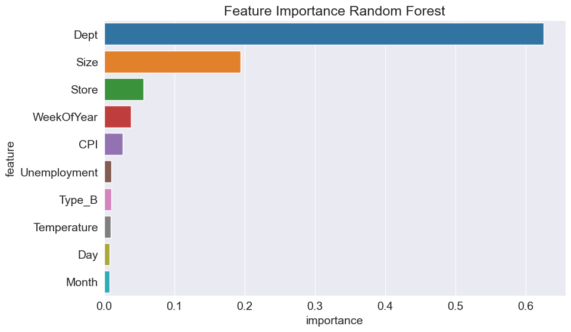
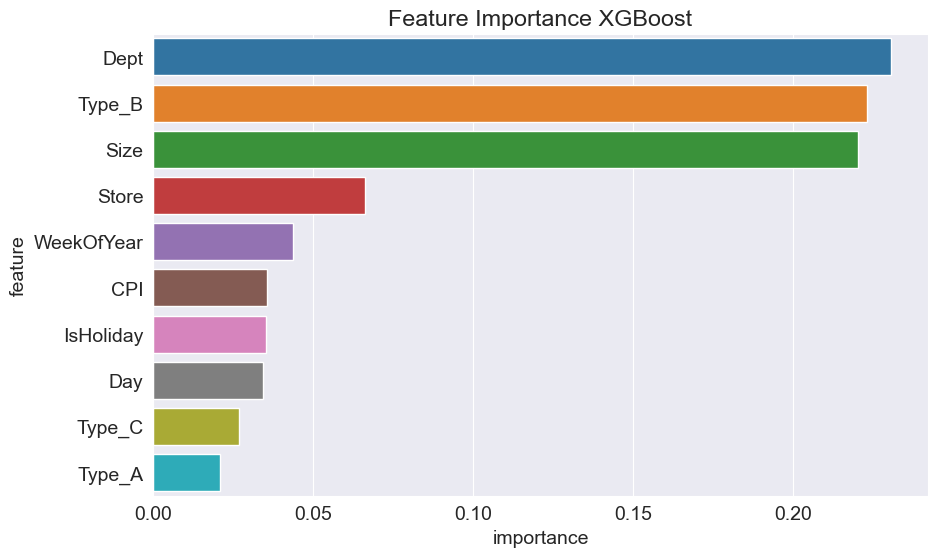
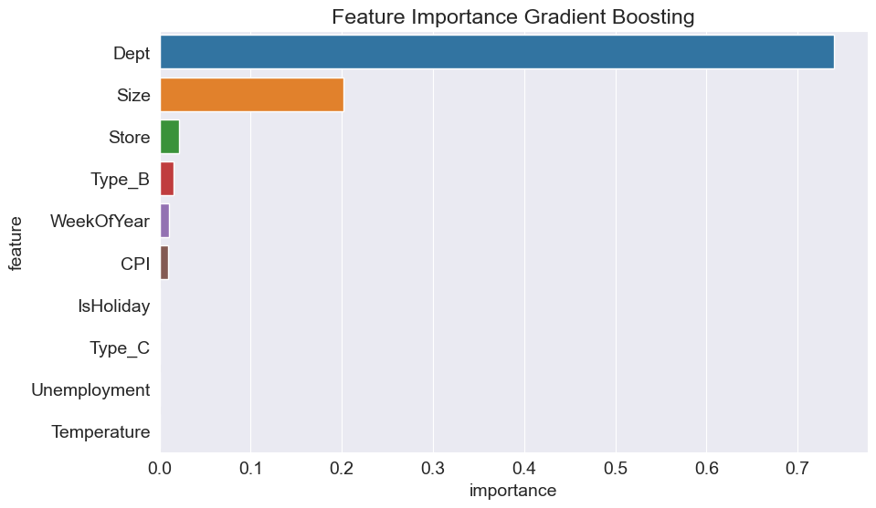
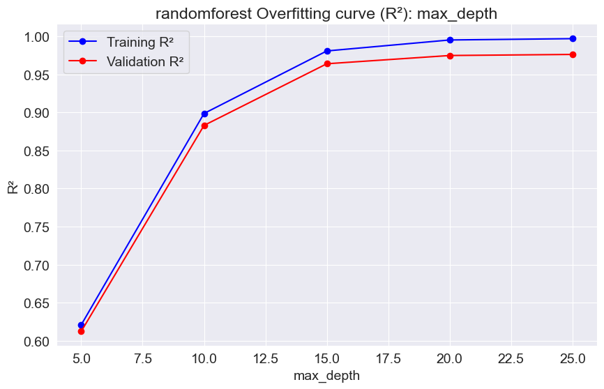
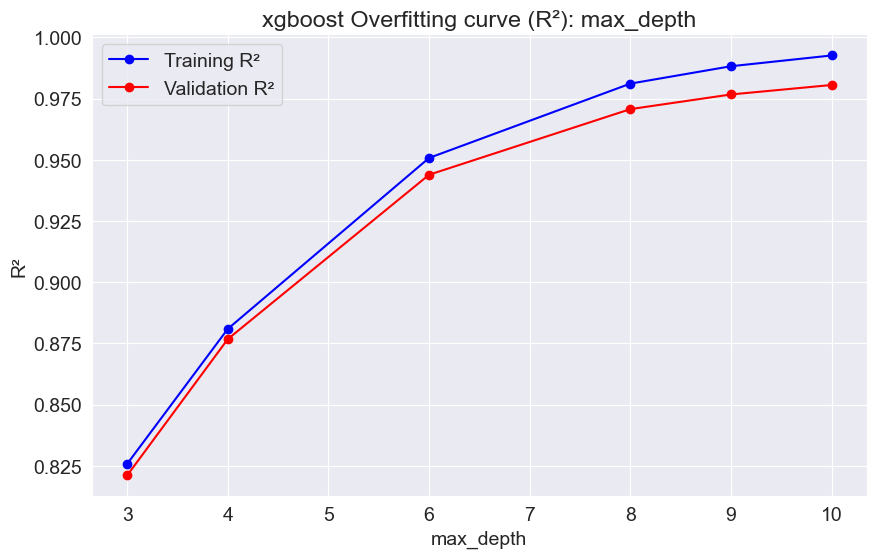

# Project-2

The dataset essentially contains five CSV files:

### stores.csv

This file contains anonymized information about the 45 stores, indicating the type and size of the store.

### train.csv

Historical training data, which covers from 2010-02-05 to 2012-11-01. Within this file, we will find the following fields:

- **Store** - store number
- **Dept** - department number
- **Date** - the week
- **Weekly_Sales** - sales for the given department in the given store
- **IsHoliday** - whether the week is a special holiday week

### features.csv

This file contains additional data related to the store, department, and regional activity for the given dates. It contains the following fields:

- **Store** - the store number
- **Date** - the week
- **Temperature** - average temperature in the region
- **Fuel_Price** - cost of fuel in the region
- **MarkDown1-5** - anonymized data related to promotional markdowns that Walmart is running. MarkDown data is only available after Nov 2011, and is not available for all stores all the time. Any missing value is marked with an NA.
- **CPI** - the consumer price index
- **Unemployment** - the unemployment rate
- **IsHoliday** - whether the week is a special holiday week

### test.csv

# Predicting Walmart Sales with Machine Learning

## Problem Statement

We used historical sales data for 45 Walmart stores located in different regions. Each store contains a number of departments, and our task was to predict the weekly sales for each store. In addition, Walmart runs several promotional markdown events throughout the year. These markdowns precede prominent holidays, the four largest of which are the Super Bowl, Labor Day, Thanksgiving, and Christmas. The weeks including these holidays are weighted five times higher in the evaluation than non-holiday weeks.

The primary project objective is to forecast future sales using machine learning models trained on historical data. Accurate sales forecasting is critical for enhancing business decision-making processes. It plays a pivotal role in strategic planning, budgeting, and risk management, enabling companies to allocate resources efficiently and manage cash flow effectively. Additionally, precise sales forecasts help businesses estimate costs and revenues accurately, facilitating reliable predictions of both short-term and long-term performance.

In the context of our project, we are dealing with a predictive modeling task where the target variable, Weekly Sales, is a labeled continuous numeric feature. This problem falls under the domain of Supervised Machine Learning as we have historical data with known outcomes that can be used to train and guide our models. More specifically, the nature of the Weekly Sales variable classifies this as a regression problem. Regression techniques are employed when the objective is to predict a continuous quantitative value, such as sales figures, based on a set of input features or predictors.

## Executive Summary

Walmart, a global retail giant, faces the challenge of accurately predicting department-wide sales for 45 stores considering promotional markdowns and holiday periods. Accurate sales forecasting is crucial for effective business planning, budgeting, and resource allocation. The goal of this project is to develop a machine learning model that can reliably forecast weekly sales, leveraging historical data from 2010 to 2012.

## Data Exploration and Preprocessing

The project utilized data from four primary sources: `stores.csv` (store type and size information), `features.csv` (store, department, and regional economic data), and `train.csv`and '`test.csv' (historical sales data). The target variable was identified as Weekly Sales, with Store, Dept, Date, and IsHoliday serving as key predictors.

To prepare the data for modeling, several preprocessing steps were undertaken. Missing values in the MarkDown columns were imputed with zeros, and the individual MarkDown columns were aggregated into a single MarkDown feature. The Date column was decomposed into various temporal components such as DayOfMonth, Month, Year, and WeekOfYear to capture seasonal patterns. Categorical variables like IsHoliday were encoded into binary format.

## Exploratory Data Analysis (EDA)

An in-depth exploratory analysis revealed significant insights into the factors influencing weekly sales.

Key findings include:

- Store Size and Dept exhibited the highest correlation with Weekly Sales.
- Sales demonstrated notable spikes during holiday periods and the fourth quarter.
- Store Type A outperformed Types B and C in terms of sales.
- Sales were found to be higher in moderate temperature ranges (30-70°F).

Visualizations such as heatmaps, scatter plots, and line graphs were employed to uncover patterns and trends in the data.

### Key Correlations

From the heatmap, Size (.24) and Dept (.15) seem to have the highest correlation with Weekly Sales.


### Average Weekly Sales Per Store


Stores 20, 4, and 14 have the highest values. The store data was anonymized, and we do not know the location of the store.

### Sales Spikes


Sales spike in November and December. As expected, November and December are the highest.

### Monthly Peaks



- Month 12: Highest peak on Day 24 with sales of 27415.85
- Month 11: Highest peak on Day 26 with sales of 22464.58

### Temperature Impact


Very cold and very hot temperatures impact the Weekly Sales.

## Model Development and Evaluation

A range of machine learning models were explored, including Linear Regression as a baseline along with ensemble models such as Random Forest, XGBoost, and Gradient Boosting Regressor. The models were evaluated using the R² metric.

### Baseline ML Model — Linear Models

Since this is a regression problem, we chose the `LinearRegression()` model as the baseline ML model. We also trained Ridge, Lasso, ElasticNet, and SGDRegressor to conduct a comprehensive comparison of the performance of all linear models offered by Sklearn. We created a function `try_linear_models(model)` that takes in the model as input, performs training on training data, and returns the training and validation root mean squared errors. The results were very bad with an R² of .09.

Because this was so low, we did not do additional work on the Linear Regression Model.

- Linear R²= .088
- Ridge R²= .088
- Lasso R²= .088
- Elasticnet R²= .041
- SGD R²= .088

### Model Evaluation

We used an Ensemble method vs a pipeline to run the next three models.

#### Random Forest Regressor Model Scores

A Random Forest Regressor is an ensemble learning method that combines multiple decision trees to improve the predictive performance and robustness of the model. (Results show this model could be overfit; we will use Hyperparameter tuning later to check.)

|            | MAE     | RMSE    | R²   |
| ---------- | ------- | ------- | ---- |
| Training   | 492.84  | 1236.34 | 1.00 |
| Validation | 1334.63 | 3509.05 | .98  |

#### XGBoost Scores

We used this model to conduct our prediction because it is an algorithm best suited for regression tasks predicting a continuous numerical value. It uses the gradient boosting technique which combines multiple weak decision tree models to create a robust predictive model. The model was trained to predict weekly sales based on features including size, temperature, fuel price, CPI, unemployment, total markdown, year, month, and week. The model was evaluated using mean squared error (MSE) and R-squared metrics.

|            | MAE     | RMSE    | R²  |
| ---------- | ------- | ------- | --- |
| Training   | 2914.42 | 5050.63 | .95 |
| Validation | 2978.43 | 5361.71 | .94 |

#### Gradient Boosting Regressor Scores

Gradient Boosting is a powerful ensemble machine-learning technique used primarily for regression and classification tasks. It builds a robust predictive model by combining multiple weak learners, typically decision trees, in a sequential manner. The key idea is to iteratively improve the model by focusing on the errors made by the previous models.

|            | MAE     | RMSE     | R²  |
| ---------- | ------- | -------- | --- |
| Training   | 6852.49 | 11590.97 | .74 |
| Validation | 6841.50 | 11637.06 | .74 |

## Feature Engineering and Selection

To enhance the predictive power of the models, several feature engineering techniques were applied. The Date column was decomposed into various temporal components capturing seasonal and cyclical patterns. The individual MarkDown columns were aggregated into a single feature, simplifying the representation of promotional markdowns.

Feature importance analysis conducted using ensemble models like Random Forest, XGBoost, and Gradient Boosting identified Dept and Size as the most influential predictors of weekly sales. This insight highlights the significance of considering store size and department as specific factors in the forecasting process.

### Feature Importance Analysis




Department and size are the two most important features.

## Hyperparameter Tuning

Initial results indicated that linear models performed poorly while ensemble models showed promise. Hyperparameter tuning was conducted using cross-validation, with Random Forest emerging as the best-performing model after optimization.

We chose two of the three models using the following variables.

### RandomForestRegressor

- `max_depth`: [5, 10, 15, 20, 25]
- `n_estimators`: [20, 50, 200, 250]
- `min_samples_split`: [2, 4, 5, 10]

### XGBRegressor

- `max_depth`: [3, 4, 6, 8, 9, 10]
- `n_estimators`: [30, 50, 200, 250]
- `learning_rate`: [0.3, 0.2, 0.1, 0.01, 0.001]

### Overfitting Curves for Random Forest Hyperparameter Tuning




### Overfitting Curves for XGBoost Hyperparameter Tuning




## Choosing the Model and Adjusting the Settings

We picked the Random Forest Regressor because we think the first outputs were overfitted.

```python
model = RandomForestRegressor(random_state=42, n_jobs=-1)
## Based on the Graphs

We selected the following variables:

- **n_estimators**: [200]
- **max_depth**: [8]
- **min_samples_split**: [5]

## Results

- **Cross-validation R² scores**: [0.96626685, 0.96708718, 0.96505649, 0.96797142, 0.96504317]
- **Mean R²**: 0.9662850228946687
- **Validation R²**: 0.9637673284267992

Based on this result, the Random Forest performed the best with an R² score of 96%.

## Conclusion and Future Directions

The project successfully developed an end-to-end machine learning pipeline for sales forecasting at Walmart. Key factors driving weekly sales were identified, providing valuable insights for business decision-making.

However, there is room for further improvement. Exploring time-series modeling techniques such as ARIMA could potentially enhance the accuracy of the forecasts. Additionally, incorporating additional features such as promotional information and competitor data may provide a more comprehensive understanding of the sales dynamics.

Future work should focus on refining the model architecture, expanding the feature set, and validating the model's performance on more recent data. Collaboration with domain experts and stakeholders will be crucial in aligning the model's objectives with business goals and ensuring its practical applicability.

This project serves as a foundation for further advancements in predictive modeling in the class and beyond, as we transition into professional roles.

```
